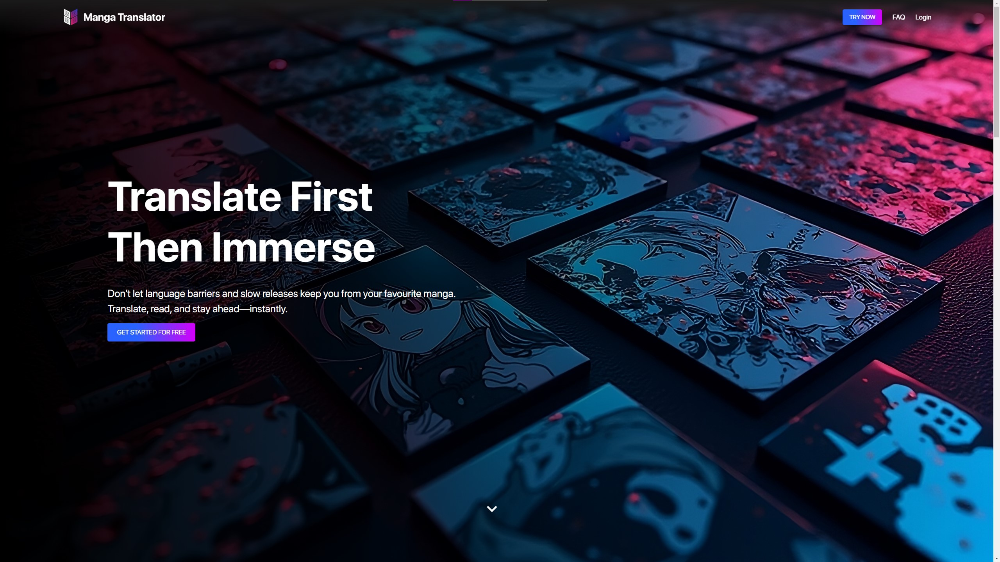
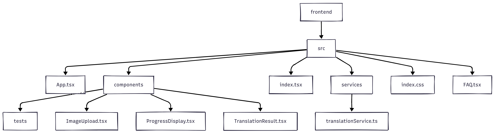

# Manga Translate

# **Summary**

Manga Translate leverages a open-source backend to handle complex processes like OCR, inpainting, and translation to achieve manga translation automation. A responsive React frontend is developed to provide a seamless, intuitive experience for manga enthusiasts. This project integrates robust AI functionality with user-friendly design, and includes a Docker Compose configuration for effortless local deployment and testing, making it accessible for both developers and end users alike.

---

# Demo

Live frontend demo: https://mph1155.github.io/manga_translate/




---

# Usage

---

### Running Directly from the Command Line

**Frontend**

1. **Navigate to the frontend directory**
    
    ```
    cd manga_translate_frontend
    ```
    
2. **Install dependencies**
    
    ```
    npm install
    ```
    
3. **Start the development server**
    
    ```
    npm start
    ```
    
    The application will be available at [http://localhost:3000](http://localhost:3000/).
    
4. **Stop the react app**
    - Press `CTRL+C` in the terminal

---

**Backend**

1. **Navigate to the backend directory**
    
    ```
    cd manga_translate_backend/manga-image-translator
    ```
    
2. **(Optional) Set up a Python virtual environment and install dependencies**
    
    ```
    python3 -m venv venv
    source venv/bin/activate    # Linux/MacOS; use venv\\Scripts\\activate on Windows
    pip install -r requirements.txt -r requirements-dev.txt
    ```
    
3. **Start the backend server**
    
    ```
    python3 server/main.py --verbose --start-instance --host=0.0.0.0 --port=5003
    ```
    
    The backend API will be accessible at [http://localhost:5003](http://localhost:5003/).
    
4. **Stop the python server**
    - Press `CTRL+C` in the terminal

---

### Running via Docker Compose

If you prefer a full containerized environment with both frontend and backend, follow these steps. (Make sure Docker and Docker Compose are installed.)

1. **From the project root directory, build and start the containers**
    
    ```
    docker-compose up --build
    ```
    
2. **Access the services**
    - Frontend: [http://localhost:3000](http://localhost:3000/)
    - Backend: [http://localhost:5003](http://localhost:5003/)
3. **Stop the containers**
    - Press `CTRL+C` in the terminal running Docker Compose

---

# Credits

This project incorporates the backend from [manga-image-translator](https://github.com/zyddnys/manga-image-translator), originally created and maintained by the community led by zyddnys. I would like to express my gratitude to the original authors and contributors for their work, which is the key of this project’s success.

For more details and updates on the original backend, please visit the [manga-image-translator](https://github.com/zyddnys/manga-image-translator) GitHub repository.

---

# Program Structure



- **App.tsx:** Main entry component. Manages state for translations, orchestrates file upload, triggers translation process, and displays results.
- **ImageUpload.tsx:** Handles file selection, drag-and-drop logic, and user input for target language. Passes selected file to App for processing.
- **ProgressDisplay.tsx:** Presents real-time translation progress status to the user (e.g. loading spinner and status text).
- **translationService.ts:** Sends translation requests to the backend, tracks progress, and provides status updates.
- **tests:** Simple unit tests for react components using the jest framework
- **TranslationResult.tsx:** Renders the translated manga image once processing is complete.
- **FAQ.tsx:** Provides frequently asked questions and answers about the webapp.
- **index.tsx:** Initializes and renders the React app and FAQ page into the browser’s DOM.
- **theme.js:** Configures MUI theme styling (colors, typography) in dark mode.
- **index.css:** Global CSS styling overrides for the entire front-end.

---

# Why this project?

As a passionate manga reader, I often face the frustration of language barriers when trying to enjoy niche or untranslated Japanese manga. While researching solutions, I discovered an open-source backend with 6k stars on GitHub that uses AI for translation, OCR, inpainting, and masking. However, it required technical expertise to set up, involving Python commands, CLI, and virtual environments—barriers that made it inaccessible to non-technical users. This inspired me to develop a React JS and Material UI frontend to simplify access to this powerful tool, enabling anyone to translate manga effortlessly.

This project reflects my ability to tackle complex challenges, learn new technologies, and create user-centric solutions. By overcoming these obstacles, I not only deepened my technical skills but also built a tool that empowers users to overcome language barriers and enjoy manga in their preferred language. It demonstrates my passion for using programming to solve real-world problems and my commitment to making technology more accessible.

---

# **Challenges Faced and Solutions Implemented**

- **Challenge 1: Unclear Backend Documentation**
    - **Problem:** The backend’s documentation lacked clarity on how to interact with it, such as where to post images as input or how to sequence the translation process.
    - **Solution:** I thoroughly analyzed the backend’s source code to understand its inner workings, identified the correct API endpoints, and learned how to use React JS to make REST API requests and integrate with the backend’s FastAPI framework.
- **Challenge 2: Dockerizing the Backend**
    - **Problem:** I had no prior experience with Docker, which was necessary to create a portable and easy-to-set-up backend environment for users.
    - **Solution:** I self-taught Docker by learning Dockerfile instructions, container setup, and image creation. I successfully produced a working Docker image for the backend, simplifying the setup process for non-technical users.
- **Challenge 3: Understanding the Translation State System**
    - **Problem:** The backend used a 4-bit code to represent the streaming state of the translation process, which was unfamiliar to me and not well-documented.
    - **Solution:** I studied the API responses, decoded the 4-bit state system, and implemented a custom function in the frontend to extract and display the real-time progress of the translation process.
- **Challenge 4: Learning Material UI and CSS Styling**
    - **Problem:** I had limited experience with Material UI and needed to refresh my CSS knowledge to create a polished and responsive UI.
    - **Solution:** I used this project as an opportunity to deepen my understanding of CSS (e.g., flexbox, animations, gradients) and Material UI components like Box, Button, Card, and image comparison sliders. This allowed me to design an intuitive and visually appealing interface.
    
    ---
    

# Development Decisions

1. Factors when deciding which react framework to use (Tailwind CSS vs Material UI)
    
    
    | Comparison Points | Tailwind CSS | Material UI |
    | --- | --- | --- |
    | Overview | Utility-first CSS framework for custom designs | React component library based on Material Design |
    | Design Flexibility | Highly flexible; allows for unique designs | Consistent design language based on Material Design |
    | Components | No pre-built components; build from scratch | Offers a wide range of pre-built components |
    | Customization | Easy to customize styles using utility classes | Customization can be complex due to abstraction |
    | Responsive Design | Utility classes make responsive design straightforward | Built-in support for responsive components |
    | Learning Curve | Requires understanding of utility-first methodology | Easier for those familiar with React and Material Design |
    | Theming | No built-in theming; full design control needed | Supports customizable themes for branding |
    | Accessibility | Accessibility depends on custom implementation | Built with accessibility best practices in mind |
    | Best For | Unique designs and complete customization | Speed, consistency, and Material Design aesthetics |
    
    Considering I am just building a personal project with a simple but friendly UI for the translator, I would be choosing Material UI because it provides ready-made design elements that make it quick and easy to build a user-friendly app. Its built-in accessibility features ensure that everyone can use the manga translator, creating a smooth experience for all users.
